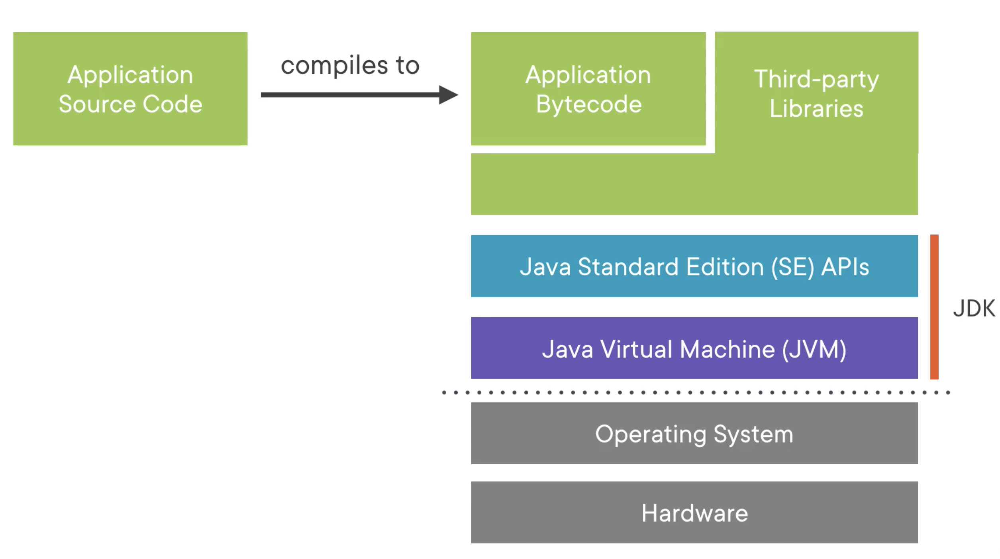
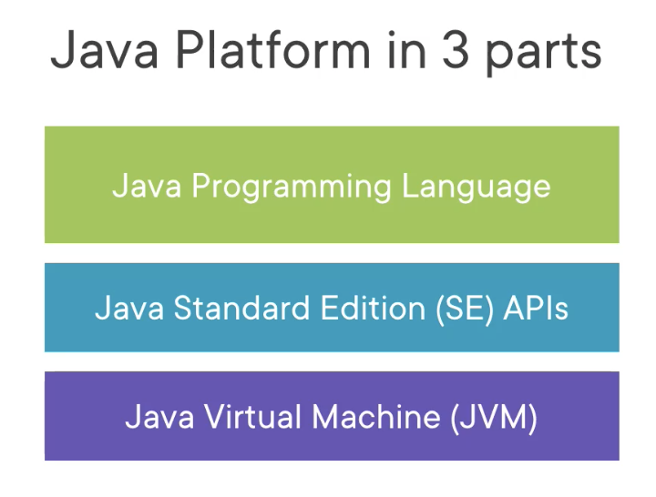

# java-17
Java 17 learning

### Compile Java Code

```java
javac class_name.java
```

### Run Compiled Java Code

``` shell
java class_name
```

> note: here we call the previus file without the extention ".java"

---
* Java Platform overview 



All application in Java have to be compile into a bytecode, this will use Java SE (Java Standard edition), this mean that Java contains a pre-set of libraries that we can use to code

The Java virual machine (JVM), that is written in "C", read and execute ours aplication in Bytecode and run in the machine, independet of the operative system.


---
* Java Platform overview simplified
