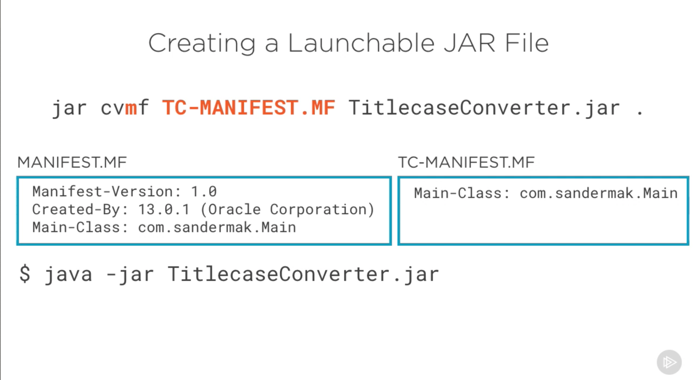

# Create a Lauching JAR File

when creating a java JAR file. you must create manifest before especifying where the main-class will be allocated

check the example in the following image:



The commands: 
```shell
jar cvmf MY-MANIFEST.MF MyJavaApp.jar
```
>note:
>
>* c = to create
>* v =  prints verbose output to standard output
>* m = metadata file name
>* f = out put file name

run the jar:

```shell
java -jar MyJavaApp.jar
```

> use man to check the manual with all the option, or go to https://docs.oracle.com/en/java/javase/17/docs/specs/man/jar.html to check the same info